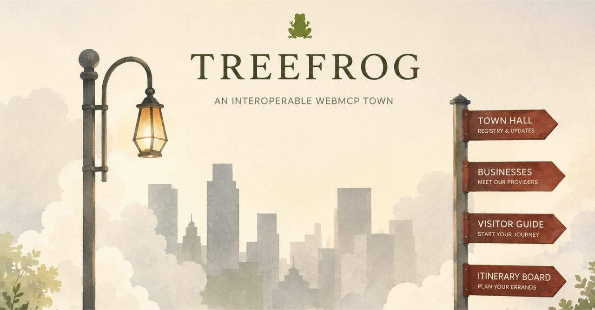

# TreeFrog

## An interoperable WebMCP town
- Population: 3
- Founded: July 2026

TreeFrog is an operational, interoperable WebMCP town built for cross-site WebMCP discovery and orchestration. 
Town Hall publishes a machine-readable provider registry and builds itineraries that a general purpose consumer can follow across independent WebMCP surfaces.

### Say it once, the town does the rest. 
From a single request, the agent chains the whole errand end-to-end, no step-by-step prompting. Say "order me a latte, book me a hair appointment, and check my art display" and the agent hops across independent provider surfaces in sequence, completes each task, and verfies the journey against the itinerary - all in one go.

See live demo here (BETA - refining voice): [WebMCP Interoperable Town Video Demo](https://www.youtube.com/watch?v=gY_1ywOK9tM)

>
## The first residents:
### ValentinCoffee.Cafe: 
- Ordering and cafe operations
### TimothyGeorge.design: 
- Salon Availability and appointment bookings
### Sirocco.Gallery: 
- Design-system inspection and conformance tools

---

## One request. Three providers. A frog that hops. 

  

>

## An agent's cross-site journey

  

>
---
## Coming soon.
- Town Hall: Operational
- Provider Registry: Operational
- Itinerary Planning: Operational
- Cross-site navigation: Operational 
- Multi-provider chain: Under construction
- Voice Execution: Connected through Refraktor

  <a href="https://www.ziola.dev">a Ziola project</a>

